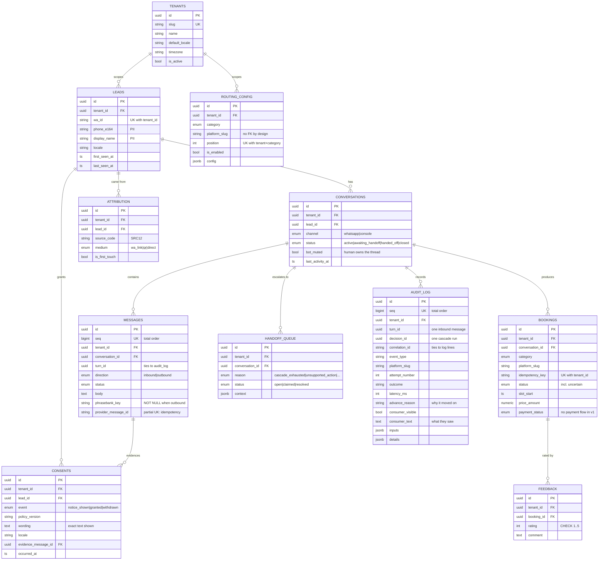

# Schema

Eleven tables. Every one except `tenants` carries `tenant_id` — the root of the
scoping hierarchy is the only thing not scoped by it.

## Notes on choices that are not obvious

**`seq` on `messages` and `audit_log`.** `created_at` cannot order rows written in
one transaction: PostgreSQL's `now()` is transaction start time, so every row in a
turn shares a timestamp and the tiebreak falls to a random UUID. Without `seq`, a
transcript reads back in arbitrary order — the inbound message can sort between
the two replies to it.

**`audit_log` is append-only, enforced by a trigger.** `UPDATE` is refused
outright. `DELETE` is refused unless the session sets `mawjood.allow_purge`, which
is how the PDPL erasure path still works while casual deletion does not.

**`audit_log.event_type` and `.outcome` are unconstrained text.** Every other
enum column is a VARCHAR with a CHECK. This one must not be: an audit write that
fails because of an unrecognised value destroys the record explaining what
happened.

**`messages.phrasebank_key` is CHECKed NOT NULL for outbound rows.** Consumer copy
that cannot name its phrasebank entry has bypassed the no-empty-shelves blocklist
scan.

**`routing_config.platform_slug` has no foreign key.** The adapter registry
(Phase 2) is the authority on which slugs exist; this table only orders them.

**`consents` is an event stream, not a flag.** Current state is derived. What a
consumer was shown, and when, survives intact.

## Deferred to Phase 2

`platforms`, `merchants` and `merchant_credentials` (decision 1 — many merchants
per platform). Nothing consumes them until the adapter layer exists, and adding
them is a clean additive migration.
